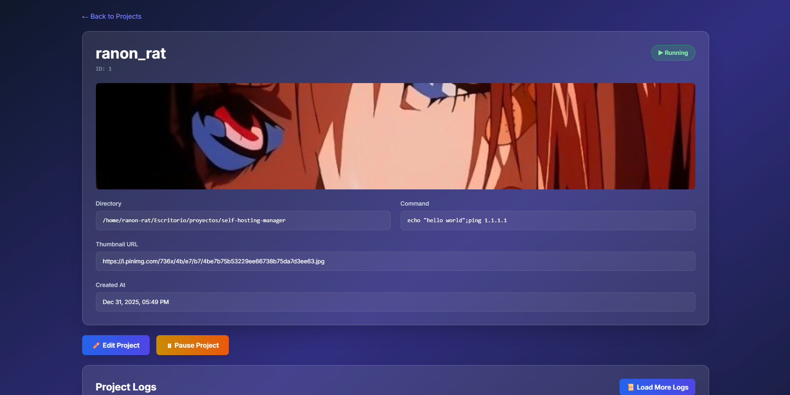
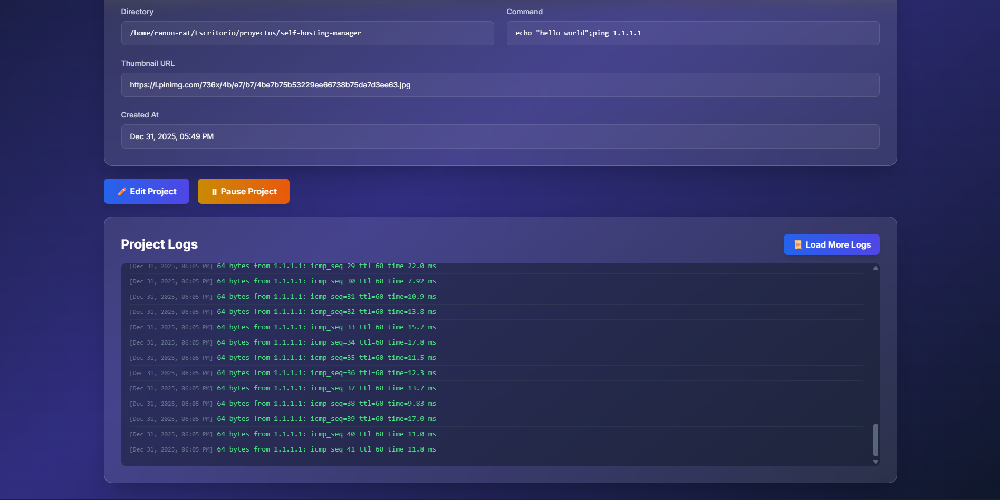
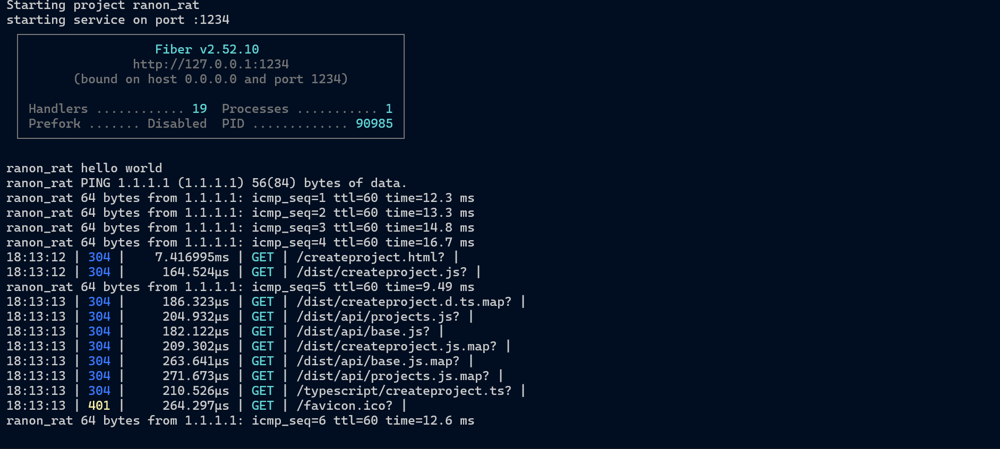

# SHP

<h3 align="center">
</h3>

This is a simple manager that i am going to be using to manage the services that I have avaible without needing to do much stuff.

> Most of the frontend code has been AI generated because I am not a frontend developer.
